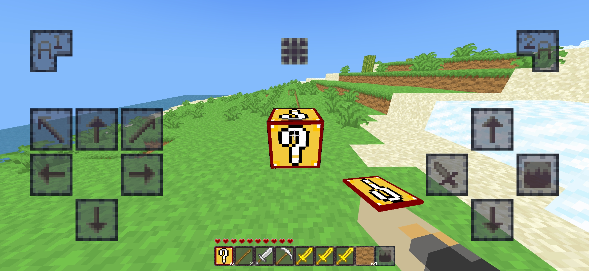

# Texturas em Minimine

As texturas é aquilo que você vê quando entra em um mundo. Ela é "pele" de tudo como itens,blocos,etc...



### Por onde começar?

Dentro da pasta das Texturas,você deve criar um arquivo json com nome ***base.json***. É nesse arquivo onde você define as texturas e os arquivos.

```json
  "pacote":"MeuMod"
```

O texto do "pacote" tem que ser ***exatamente o nome da pasta do mod*** pois será esse valor que jogo usará para encontrar as imagens

### Como adiocionar uma textura ao jogo?

Simples! Primeiro você diz onde a imagem da textura está no `base.json`. 

Seguindo o formato `<nome do arquivo>:<caminho da imagem>`

_O nome do arquivo pode ser qualquer um_

```json
  "arquivos":{
    "texturaNova":"Texturas/blocos.png"
  }
```

Um detalhe importante as texturas são definidas a partir de um ***sprite sheet***

| Nome | Função |
|---|---|
| x | Define a posição horizontal onde a textura começa |
| y | Define a posição vertical onde a textura começa |
| alt | Define a altura da textura |
| larg | Define a largura da textura |

Uma textura com posição (0,0),ou seja,x = 0,y = 0, começa no canto superior esquerdo.

```text
#
```

Agora se adiocionarmos 16 de largura e 16 de altura. Fica assim:

```text
################
#              #
#              #
#              #
#              #
#              #
#              #
#              #
#              #
#              #
#              #
#              #
#              #
#              #
#              #
################   
```

Agora com conceito explicado vamos para pratica.

```json
  "texturas":[
    {
        "nome": "TexturaBloco",
        "arquivo": "texturaNova",
        "regiao": "blocos",
        "x": 0,
        "y": 0,
        "larg": 16,
        "alt": 16
    }
  ]
```

### Exemplo Completo

```json
{
  "pacote":"MeuMod",

  "arquivos":{
    "texturaNova":"Texturas/blocos.png"
  },

  "texturas":[
    {
        "nome": "TexturaBloco",
        "arquivo": "texturaNova",
        "regiao": "blocos",
        "x": 0,
        "y": 0,
        "larg": 16,
        "alt": 16
    }
  ]
}
```

| Nome | Função |
|---|---|
| nome | Define o nome da textura para jogo |
| arquivo | A imagem que a textura vai utilizar |
| regiao | Define o grupo de texturas onde a textura pertence e como ela será renderizada, pode ser `blocos,itens,ui,particulas`|